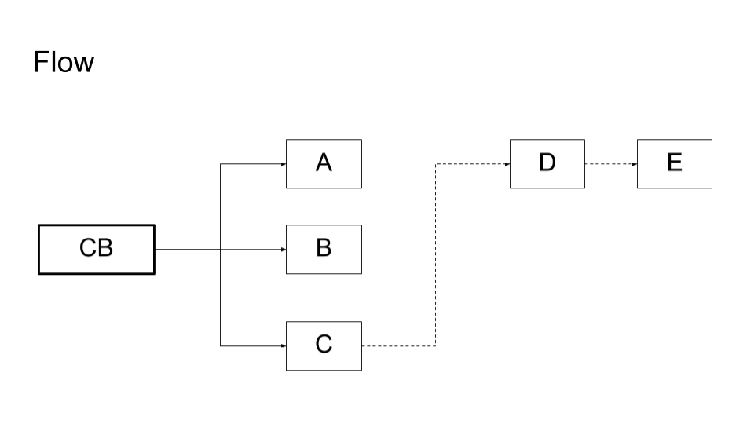
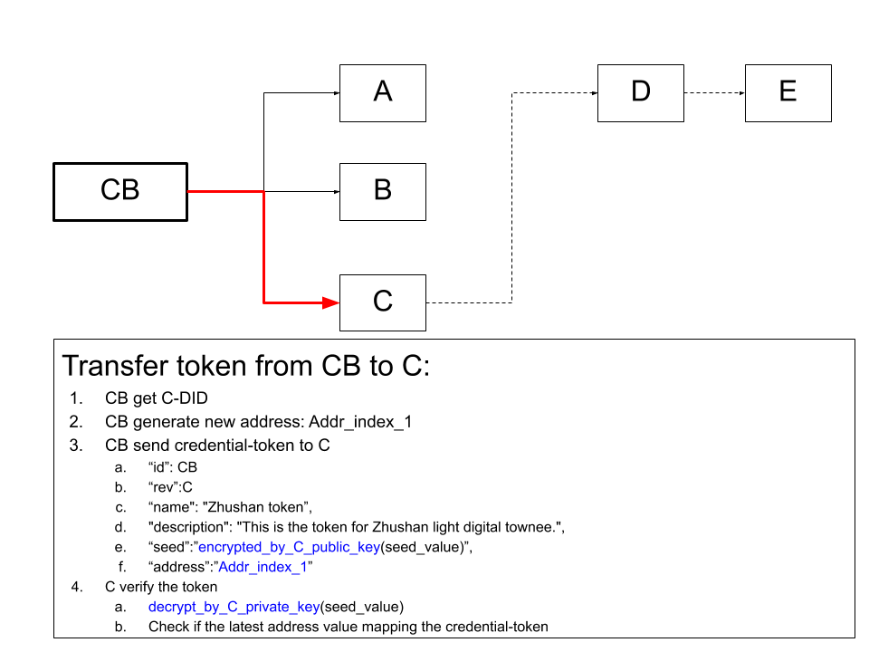
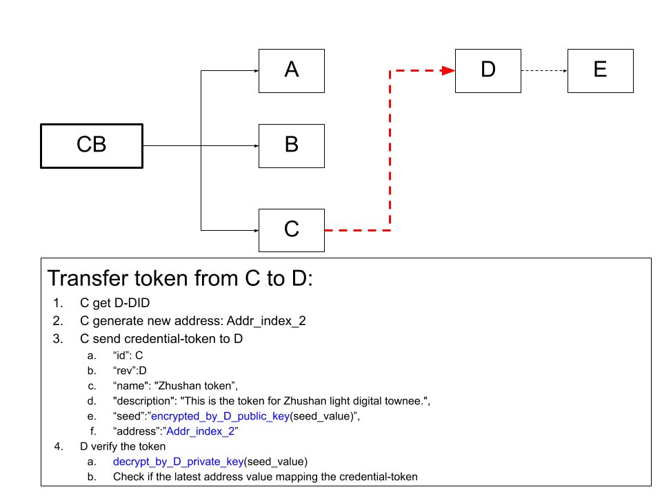

# iota-colored-coin

Using [DID specification](https://w3c.github.io/did-core/) to issue claims as IOTA colored coin.
A simple workflow as below:



## Scenarios:

#### Layer-1: CB to C
```$ python3 cb-c.py```


#### Layer-2: C to D
```$ python3 cb-c.py```
```$ python3 c-d.py```

